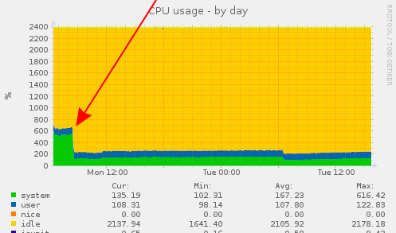
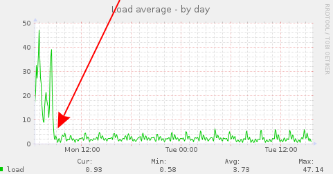
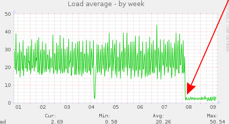

# nsca_fast

**A faster, high-performance drop-in replacement for the Nagios NSCA (Nagios Service Check Acceptor) server** — with pre-forked workers and a fixed-size thread pool. Wire-compatible with the stock `send_nsca` clients, so nothing changes on the sender side.


nsca_fast is a network daemon that accepts passive check results from `send_nsca` and forwards them to **Nagios Core, Icinga or Naemon** via the external command file (FIFO) and/or the `check_result_path` spool directory. It is built on `libevent` and scales to ~14k checks/second on a single mid-range CPU — where the original NSCA daemon drops checks under systemd.

## Features

- **Drop-in replacement** — keep your existing `nsca.cfg` and `send_nsca` clients; only a few new options are introduced.
- **Pre-forked workers** using the kernel's `SO_REUSEPORT` — no runaway child processes.
- **Fixed-size thread pool** per worker for mcrypt decryption — bounded, predictable resource usage.
- **libevent-based** event loop — no per-connection fork, so it works cleanly under systemd.
- **FIFO and `check_result_path` at the same time**, with automatic fallback if the FIFO write fails.
- **Optional inotify-based cap** on unprocessed spool files, so a stopped monitoring core can't fill the disk.

## Why nsca_fast?

### Problems with the original NSCA daemon
  - If you have a high traffic NSCA server you will probably end up with a lot of child processes.
  - Connection timeouts are not handled and child processes get stuck there forever.
  - If you use any encryption method (mcrypt) it will block the read on the connection.
  - Since systemd is present on newer Ubuntu releases, the fork + `openlog()`/syslog model just does not work; and without fork mode you can't handle large scale monitoring.

### Why not nsca-ng, etc?
  - Who wants to replace their clients' `send_nsca` binary? Who wants to use a different protocol?
  - This is just a drop-in replacement for the NSCA server. You can keep the old configuration if you want. Only a few new options are introduced.
  - It mostly reuses the original `nsca/utils.h` and `nsca/utils.c`, so it can be upgraded in no time if the Nagios core changes anything in their code.

## Performance

Real-world example — CPU **Intel E-2136** (cpubenchmark.net: ~13K), `nsca.cfg` with `encryption_method=3`:

| Setup | Throughput |
|-------|-----------|
| original nsca, anything without systemd | ~850 checks/second (dropped checks above that; occasionally scaled to ~5k) |
| original nsca, Ubuntu bionic + systemd | ~850 checks/second (dropped checks / timeouts above that, could not scale up at all — full restart needed) |
| **nsca_fast** | **~14k checks/second** |

- It can use a fixed number of workers (fork) with the kernel's `SO_REUSEPORT` support.
- It uses fixed-size thread pools inside the workers, so you won't end up with infinite workers and infinite thread pools.
- It supports FIFO and `check_result_path` at the same time if you set both. First it writes the result into the FIFO, and if that fails it saves it in the `check_result_path`.

## Installation

### Dependencies
  - libevent2 (`libevent-dev`)
  - libmcrypt (`libmcrypt-dev`)

### Build (Ubuntu 18.04 / 22.04 / 24.04)
```sh
apt-get install libevent-dev libmcrypt-dev cmake make g++
# chdir into the source directory
cmake .
make -j5
```

Prebuilt `.deb` packages are published under [Releases](https://github.com/macskas/nsca_fast/releases).

## Compatibility

  - **Monitoring cores:** Nagios Core, Icinga, Naemon
  - **Clients:** stock `send_nsca` (NSCA protocol v3)
  - **Tested on:** Ubuntu 22.04 (jammy), Ubuntu 24.04 (noble)

## Configuration

Existing `nsca.cfg` files work as-is. The following options are **new** in nsca_fast:

```ini
decryption_mode=1              # default is 1, this is faster. 0 is more secure
nsca_workers=4
nsca_threads_per_worker=8
max_checks_per_connection=5000
max_packet_age_enabled=0       # by default the packet age check is disabled in the original nsca server even
                               # if you set max_packet_age. I keep it that way, but you can override the
                               # Nagios core behaviour by setting this value to 1. I don't think it is a good
                               # idea if NTP sync is disabled on the clients.
check_result_path_max_files=0  # if the Nagios core process is not running it won't process check_result_path
                               # files, so they might fill up the disk eventually. To avoid that you can
                               # specify a maximum number of unprocessed files. (It uses inotify instead of a
                               # directory listing, so it's a low-IO operation even on a physical disk, not
                               # only tmpfs.)
```

## Usage (CLI)

```
root@server:~# nsca -h
Usage: nsca [OPTIONS]
nsca.

Mandatory arguments to long options are mandatory for short options too.
  -h                    this screen
  -c [FILE]             configfile
  -d                    verbose output
  -f                    foreground
  -n [MAX_WORKERS]      max workers - between 0 and 100
  -t [THREADS]          max_threads_per_worker - between 0 and 1000
```

## Debug mode

```
root@server:~# nsca -d -f -n 1 -t 1
2020-12-18 13:04:29 DEBUG [23697] > [config] debug=0
2020-12-18 13:04:29 DEBUG [23697] > [config] pid_file='/tmp/nsca.pid'
2020-12-18 13:04:29 DEBUG [23697] > [config] server_address='0.0.0.0'
2020-12-18 13:04:29 DEBUG [23697] > [config] server_port=5667
2020-12-18 13:04:29 DEBUG [23697] > [config] nsca_user='nobody'
2020-12-18 13:04:29 DEBUG [23697] > [config] nsca_group='nogroup'
2020-12-18 13:04:29 DEBUG [23697] > [config] command_file='/tmp/testfifo'
2020-12-18 13:04:29 DEBUG [23697] > [config] check_result_path='/tmp/nagiostest'
2020-12-18 13:04:29 DEBUG [23697] > [config] max_packet_age=200
2020-12-18 13:04:29 DEBUG [23697] > [config] max_packet_age_enabled=0
2020-12-18 13:04:29 DEBUG [23697] > [config] decryption_method=3
2020-12-18 13:04:29 DEBUG [23697] > [config] password='passwordtest'
2020-12-18 13:04:29 DEBUG [23697] > [config] nsca_workers='1'
2020-12-18 13:04:29 DEBUG [23697] > [config] nsca_threads_per_worker='1'
2020-12-18 13:04:29 DEBUG [23697] > [config] max_checks_per_connection='5000'
2020-12-18 13:04:29 DEBUG [23697] > [config] decryption_mode/SHARED_CRYPT_INSTANCE=1
2020-12-18 13:04:29 DEBUG [23697] > [void writepid()] pidfile=/tmp/nsca.pid, pid=23697
2020-12-18 13:04:29 DEBUG [23697] > [processManager::loop] started
2020-12-18 13:04:29 DEBUG [23697] > [super_downgrade] Changed groupname=nobody, gid=1000
2020-12-18 13:04:29 DEBUG [23697] > [super_downgrade] Changed username=nogroup, uid=1000
2020-12-18 13:04:29 DEBUG [23697] > [void processManager::work()] started
2020-12-18 13:04:29 DEBUG [23697] > [fifo_client::fifo_client(std::__cxx11::string)]
2020-12-18 13:04:29 DEBUG [23697] > [void network::run()]
2020-12-18 13:04:29 DEBUG [23697] > [void crypt_thread_t::loop()] started.
2020-12-18 13:04:30 INFO  [23697] > [network statistics] 0 conn/s, connections=0, report_success=0, report_failed=0
2020-12-18 13:04:35 INFO  [23697] > [network statistics] 0 conn/s, connections=0, report_success=0, report_failed=0
^C2020-12-18 13:04:36 DEBUG [23697] > [int network::stop()]
2020-12-18 13:04:37 DEBUG [23697] > [void network::run()] finished.
2020-12-18 13:04:37 DEBUG [23697] > [fifo_client::~fifo_client()]
2020-12-18 13:04:37 DEBUG [23697] > [void crypt_thread_t::join()] join.
2020-12-18 13:04:37 DEBUG [23697] > [void crypt_thread_t::loop()] finished.
2020-12-18 13:04:37 DEBUG [23697] > [void crypt_thread_t::join()] joined.
2020-12-18 13:04:37 DEBUG [23697] > [processManager::loop] finished
```

## Screenshots

Munin graphs after upgrading from the original NSCA server to nsca_fast:





## License

GPL v3 — see [LICENSE](LICENSE).
